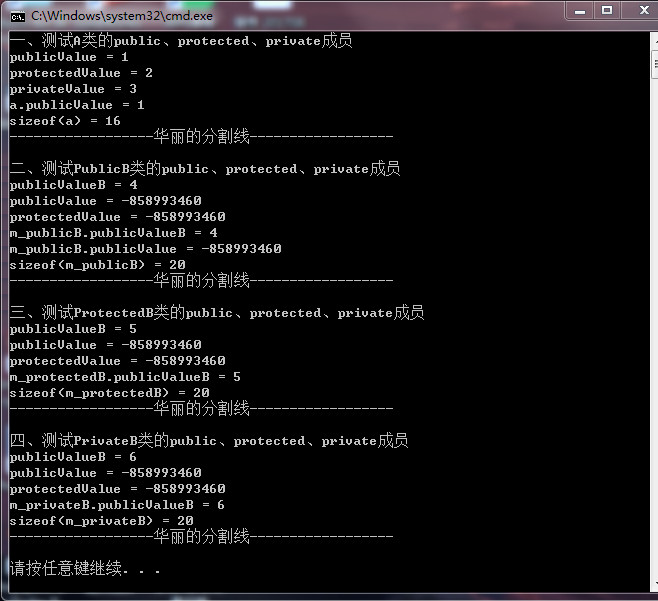

# public、protected、private继承的区别

## 写在前面

在学习C++时经常会混淆public、protected、private在继承中的概念，于是写在此博客加深理解。
首先记住以下三点：
- **用户代码（类外）只能访问public成员变量和public成员函数。**
- **子类（继承类）能访问基类的public和protected成员（包括变量和函数），但不能访问基类的private成员（包括变量和函数），本质原因为基类的private变量不能被继承。**
- **private成员只能被类内成员和友元friend成员访问。**
## 一、具体实例
### 1.1首先，我们创建一个基类A

**A.h中的代码:**
```C++
#pragma once
#ifndef A_H
#define A_H

class A
{
public:
	int publicValue;
	A();//编译器的默认构造函数
	A(int pbV, int pbV1, int ptV);//自己声明的构造函数
	virtual ~A();//为多态基类声明virtual析构函数
	void funA();
protected:
	int protectedValue;
private:
	int privateValue;
};

#endif // !A_H
```
**A.cpp中的代码**
```C++
#include "A.h"
#include<iostream>
A::A()
{
}

A::A(int pbV,int ptV, int pvV): 
	publicValue(pbV), protectedValue(ptV), privateValue(pvV)
{
}


A::~A()
{
}

void A::funA()
{
	std::cout << "publicValue = " << publicValue << std::endl;//正确，类内访问public成员
	std::cout << "protectedValue = " << protectedValue << std::endl;//正确，类内访问protected成员
	std::cout << "privateValue = " << privateValue << std::endl;//正确，类内访问private成员
}
```
>我们可以看出，在A类中，有一个public成员变量publicValue，一个protectd成员变量protectedValue，一个private成员变量privateValue。同时，还有一个public成员函数funA，我们用此函数打印输出A类的成员变量。
### 1.2使用public继承方式，创建一个子类（继承类）PublicB

**PublicB.h中的代码**
```C++
#pragma once
#ifndef PUBLICB_H
#define PUBLICB_H

//如果要接口与实现分离，pimp方法不应该用include方法，
//应使用前置声明class A;
//这里我们只讨论public、protected、private，不讨论接口与实现分离
#include "A.h"  
#include<iostream>
//PublicB以public方式继承A
class PublicB :
	public A {
public:
	int publicValueB;//PublicB的public成员
	PublicB();
	PublicB(int pbV);
	void funB();
	~PublicB();
};

#endif // !PUBLICB_H
```
**PublicB.cpp中的代码**
```C++
#include "PublicB.h"

PublicB::PublicB() {
}

PublicB::PublicB(int pbV) :publicValueB(pbV){}
void PublicB::funB() {
	std::cout << "publicValueB = " << publicValueB << std::endl;//正确，public成员
	std::cout << "publicValue = " << publicValue << std::endl;//正确，public继承类访问基类的public成员,但值是多少呢？
	std::cout << "protectedValue = " << protectedValue << std::endl;//正确，public继承类访问基类的protected成员，但值是多少呢？
	//std::cout << "privateValue = " << privateValue << std::endl;//错误，继承类不能访问基类的private成员,本质上是基类的私有成员不能被继承
}

PublicB::~PublicB() {
}

```
>我们可以看出，在PublicB类中，有两个public成员变量publicValueB、从A中继承而来的publicValue，一个protectd成员变量protectedValue。同时，还有一个public成员函数funB，我们用此函数打印输出PublicB类的成员变量。
### 1.3使用protected方式，创建一个子类ProtectedB

**ProtectedB.h中的代码**
```C++
#pragma once
#ifndef PROTECTEDB_H
#define PROTECTEDB_H

#include "A.h"
#include<iostream>
class ProtectedB :
	protected A {
public:
	int publicValueB;//ProtectedB的public成员
	ProtectedB();
	ProtectedB(int pbV);
	void funB();
	~ProtectedB();
};

#endif // !PROTECTEDB_H
```
**ProtectedB.cpp中的代码**
```C++
#include "ProtectedB.h"
ProtectedB::ProtectedB() {
}

ProtectedB::ProtectedB(int pbV): publicValueB(pbV) {
}


void ProtectedB::funB() {
	std::cout << "publicValueB = " << publicValueB << std::endl;//正确，public成员
	std::cout << "publicValue = " << publicValue << std::endl;//正确，基类public成员,在派生类中变成了protected,可以被派生类访问。但是值是多少呢？
	std::cout << "protectedValue = " << protectedValue << std::endl;//正确，基类protected成员,在派生类中变成了protected,可以被派生类访问。但是值是多少呢？
	//std::cout << "privateValue = " << privateValue << std::endl;//错误，基类private成员,不能被派生类访问。本质上是基类的私有成员不能被继承。
}

ProtectedB::~ProtectedB() {
}
```
>我们可以看出，在ProtectedB类中，有两个public成员变量publicValueB、从A中继承而来的publicValue，一个protectd成员变量protectedValue。同时，还有一个public成员函数funB，我们用此函数打印输出ProtectedB类的成员变量。

### 1.4使用private方式，创建一个子类PrivateB

**PrivateB.h中的代码**
```C++
#pragma once
#include "A.h"
#include<iostream>
#ifndef PRIVATEB_H
#define PRIVATEB_H

class PrivateB :
	private A {
public:
	int publicValueB;//ProtectedB的public成员
	PrivateB(int pbV);
	void funB();
	PrivateB();
	~PrivateB();
};

#endif // !PRIVATEB_H
```
**PrivateB.cpp中的代码**
```C++
#include "PrivateB.h"
PrivateB::PrivateB(int pbV) : publicValueB(pbV){
}

void PrivateB::funB() {
	std::cout << "publicValueB = " << publicValueB << std::endl;//正确，public成员
	std::cout << "publicValue = " << publicValue << std::endl;//正确，基类public成员,在派生类中变成了private,可以被派生类访问。但是值是多少呢？
	std::cout << "protectedValue = " << protectedValue << std::endl;//正确，基类protected成员,在派生类中变成了private,可以被派生类访问。但是值是多少呢？
	//std::cout << "privateValue = " << privateValue << std::endl;//错误，基类private成员,不能被派生类访问。本质上是基类的私有成员不能被继承。
}

PrivateB::PrivateB() {
}


PrivateB::~PrivateB() {
}

```
>我们可以看出，在PrivateB类中，有两个public成员变量publicValueB、从A中继承而来的publicValue，一个protectd成员变量protectedValue。同时，还有一个public成员函数funB，我们用此函数打印输出PrivateB类的成员变量。
### 1.5我们创建main.cpp来测试我们的类

**main.cpp中的代码**
```C++
#include"A.h"
#include"PublicB.h"
#include"ProtectedB.h"
#include"PrivateB.h"
#include<iostream>
int main() {
	/*一、测试A类的public、protected、private成员*/
	std::cout << "一、测试A类的public、protected、private成员" << std::endl;
	A a(1,2,3);
	a.funA();
	std::cout << "a.publicValue = " << a.publicValue << std::endl;//正确，类外用户访问A的public成员
	//std::cout << a.protectedValue << std::endl; //错误，类外用户不能访问A的protected成员
	//std::cout << a.privateValue << std::endl;//错误，类外用户不能访问A的private成员
	std::cout << "sizeof(a) = " << sizeof(a) << std::endl;
	std::cout << "------------------华丽的分割线------------------" << std::endl << std::endl;//正确，类外用户访问A的public成员

	/*二、测试PublicB类的public、protected、private成员*/
	std::cout << "二、测试PublicB类的public、protected、private成员" << std::endl;
	PublicB m_publicB(4);
	m_publicB.funB();//正确，类外用户访问PublicB的public成员函数
	std::cout << "m_publicB.publicValueB = " << m_publicB.publicValueB << std::endl;//正确，类外用户访问PublicB的public成员
	std::cout << "m_publicB.publicValue = " << m_publicB.publicValue << std::endl;//正确，类外用户访问PublicB继承A来的public成员,,但是值是多少呢？
	//std::cout << m_publicB.protectedValue << std::endl;//错误，类外用户不能访问PublicB继承A来的protected成员
	//std::cout << m_publicB.privateValue << std::endl;//错误，类外用户不能访问PublicB继承A来的privateValue成员
	std::cout << "sizeof(m_publicB) = " << sizeof(m_publicB) << std::endl;
	std::cout << "------------------华丽的分割线------------------" << std::endl << std::endl;

	/*三、测试ProtectedB类的public、protected、private成员*/
	std::cout << "三、测试ProtectedB类的public、protected、private成员" << std::endl;
	ProtectedB m_protectedB(5);
	m_protectedB.funB();//正确，类外用户访问ProtectedB的public成员函数
	std::cout << "m_protectedB.publicValueB = " << m_protectedB.publicValueB << std::endl;//正确，类外用户访问ProtectedB的public成员
	//这里，类外用户访问ProtectedB继承A来的public成员,但在ProtectedB类中变成了protected成员
	//std::cout << "m_protectedB.publicValue = " << m_protectedB.publicValue << std::endl;//错误，类外用户不能访问ProtectedB类的protected成员
	//std::cout << m_publicB.protectedValue << std::endl;//错误，类外用户不能访问ProtectedB继承A来的protected成员，这里变成ProtectedB类的protected成员
	//std::cout << m_publicB.privateValue << std::endl;//错误，类外用户不能访问ProtectedB继承A来的privateValue成员，这里变成ProtectedB类的protected成员
	std::cout << "sizeof(m_protectedB) = " << sizeof(m_protectedB) << std::endl;
	std::cout << "------------------华丽的分割线------------------" << std::endl << std::endl;


	/*四、测试PrivateB类的public、protected、private成员*/
	std::cout << "四、测试PrivateB类的public、protected、private成员" << std::endl;
	PrivateB m_privateB(6);
	m_privateB.funB();//正确，类外用户访问ProtectedB的public成员函数
	std::cout << "m_privateB.publicValueB = " << m_privateB.publicValueB << std::endl;//正确，类外用户访问m_privateB的public成员
	//这里，类外用户访问m_privateB继承A来的public成员,但在m_privateB类中变成了private成员
	//std::cout << "m_privateB.publicValue = " << m_privateB.publicValue << std::endl;//错误，类外用户不能访问PrivateB类的private成员
	//std::cout << m_privateB.protectedValue << std::endl;//错误，类外用户不能访问PrivateB继承A来的protected成员,这里变成PrivateB类的private成员
	//std::cout << m_privateB.privateValue << std::endl;//错误，类外用户不能访问PrivateB继承A来的privateValue成员，这里变成PrivateB类的private成员
	std::cout << "sizeof(m_privateB) = " << sizeof(m_privateB) << std::endl;
	std::cout << "------------------华丽的分割线------------------" << std::endl << std::endl;
	
	system("pause");
	return 0;
}
```
**运行结果如下：**



**因此，我们可以总结以下几点：**

- **子类可以访问基类的public成员、protected成员，但具体的值发生了变化？**
- **public、protected、private方式继承后,成员属性的变化如下表：**

 基类成员属性 | public继承的子类成员属性 | protected继承的子类成员属性 | private继承的子类成员的属性 
------------ | ------------- |  ------------- | ------------- 
 public | public | protected | private 
 protected | protected | protected | private 
 private | 不能继承 | 不能继承 | 不能继承 
 
 >那么，问题来了？如果我们非要访问基类的private成员，该怎么实现呢？

**不要慌，这里有两种方法:**

- 在基类中的public下，添加方法getPrivateValue()。如下：

```C++
public:
const int& getPrivateValue();
```
**这里返回一个const引用：保护基类的private成员不能被修改，同时用引用是数据传递比reference-to-value更高效。**

- 使用友元。在A类中，声明PublicB、ProtectedB、PrivateB为A类的友元。如下：
```C++
friend class PublicB;
friend class ProtectedB;
friend class PrivateB;
```
